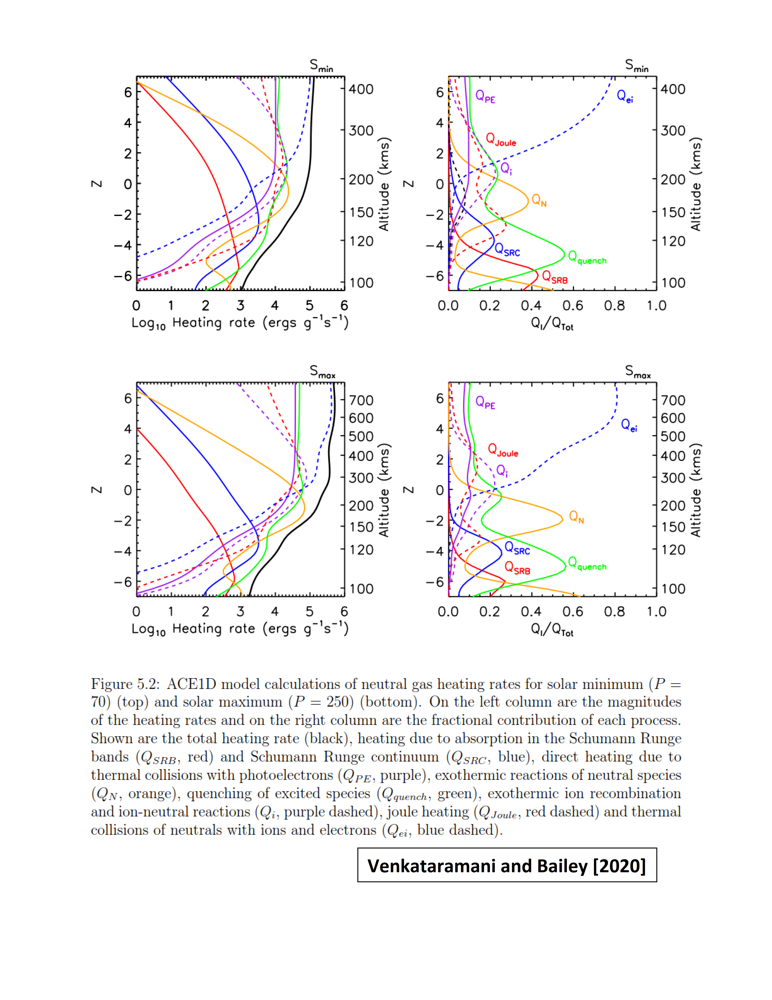

The Atmospheric Chemistry and Energetics (ACE) 1D model, implemented in IDL

Authors: Karthik Venkataramani, Scott M Bailey, Virginia Tech

Contact: Karthik Venkataramani (karthikvt "at" vt "dot" edu) w/ subject line : ACE1D

This is a 1D coupled model of the Earth's thermosphere and ionosphere, and builds upon the work of the Global Average Ionosphere Thermosphere model [GAIT - Smithtro et al., 2005], the Global Mean Model [GMM - Roble et al., 1987], and the Thermosphere-Ionosphere-Electrodynamics General Circulation Model [TIE-GCM, Dickinson et al., 1981]

The model is written in IDL, and is called by running the 'run_ace1d.pro' procedure from the terminal. This file also contains inputs that can be changed (presently, F107 indices and output filename).

