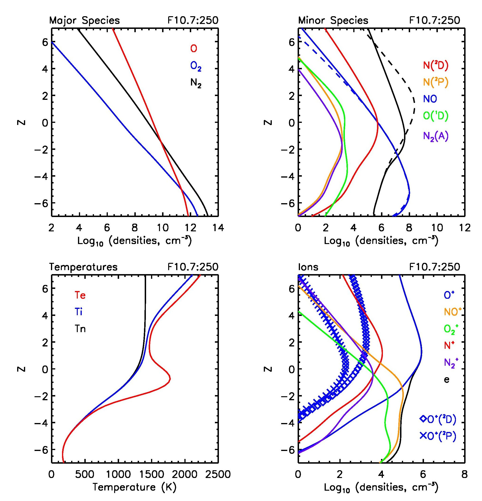

The Atmospheric Chemistry and Energetics (ACE) 1D model, implemented in IDL

Authors: Karthik Venkataramani, Scott M Bailey, Justin Yonker Virginia Tech

Contact: Karthik Venkataramani (karthikvt at vt dot edu) w/ subject line : ACE1D


This is a 1D coupled model of the Earth's thermosphere and ionosphere, and builds upon the work of the Global Average Ionosphere Thermosphere model [GAIT - Smithtro et al., 2005], the Global Mean Model [GMM - Roble et al., 1987], and the Thermosphere-Ionosphere-Electrodynamics General Circulation Model [TIE-GCM, Dickinson et al., 1981]

The model is written in IDL, and is called by running the 'run_ace1d.pro' procedure from the terminal. This file also contains inputs that can be changed (presently, F107 indices and output filename).


### Generating plots
I've tried to provide the code needed to reproduce the plots shown here. These codes can be found under the 'plotting' folder. To get the color tables, line weights, and character weights *exactly* right, run the `env_setup` code prior to running other codes. I.e., -

```
IDL> env_setup
% Compiled module: ENV_SETUP.
IDL> plot_diagnostics, '../src/solar_min_max_run.sav', /ps
```
should generate the below plots : 



